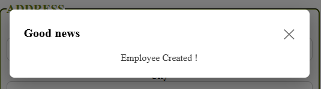

# React + Vite

This template provides a minimal setup to get React working in Vite with HMR and some ESLint rules.

Currently, two official plugins are available:

- [@vitejs/plugin-react](https://github.com/vitejs/vite-plugin-react/blob/main/packages/plugin-react) uses [Babel](https://babeljs.io/) for Fast Refresh
- [@vitejs/plugin-react-swc](https://github.com/vitejs/vite-plugin-react/blob/main/packages/plugin-react-swc) uses [SWC](https://swc.rs/) for Fast Refresh

## Expanding the ESLint configuration

If you are developing a production application, we recommend using TypeScript with type-aware lint rules enabled. Check out the [TS template](https://github.com/vitejs/vite/tree/main/packages/create-vite/template-react-ts) for information on how to integrate TypeScript and [`typescript-eslint`](https://typescript-eslint.io) in your project.


# 📦 Modale React — `modale_form_npm`

Une **modale légère et accessible** pour vos projets React, idéale pour afficher des messages de confirmation ou d'information après la soumission d'un formulaire.

Voici une démo de l'interface ;



## 🚀 Installation

Installez le package via npm :

```bash
npm install modale_form_npm
```

## 🧱 Utilisation

Voici un exemple simple d'intégration dans un composant React :

```jsx
import { useState } from 'react'
import Modal from 'modale_form_npm'

function App() {
  const [showModal, setShowModal] = useState(false)

  return (
    <>
      <button onClick={() => setShowModal(true)}>Ouvrir la modale</button>

      <Modal
        isOpen={showModal}
        onClose={() => setShowModal(false)}
        title="Confirmation"
      >
        <p>L'utilisateur a bien été enregistré !</p>
      </Modal>
    </>
  )
}
```

## ⚙️ Props

| Prop       | Type        | Description                                          |
|------------|-------------|------------------------------------------------------|
| `isOpen`   | `boolean`   | Affiche ou masque la modale                          |
| `onClose`  | `function`  | Fonction appelée lorsqu'on ferme la modale          |
| `title`    | `string`    | Titre affiché en haut de la modale                  |
| `children` | `ReactNode` | Contenu HTML/JSX à afficher dans le corps de la modale |

## 🎨 Style

- La modale utilise des **styles inline** : aucun fichier CSS à importer.
- Une animation simple `fadeIn` est incluse pour l’apparition de la modale.
- Le bouton de fermeture `✕` est accessible et réagit au clavier (`Escape`).

## 💡 Fonctionnalités

- Fermeture de la modale par clic en dehors ou par touche `Escape`
- Responsive et simple à intégrer dans n’importe quel formulaire
- Aucune dépendance CSS externe

## 🛠 Développement local

Pour tester ou modifier la modale localement :

```bash
git clone https://github.com/marlener87/npm_modale_react.git
cd npm_modale_react
npm install
npm run dev
```

Pour compiler la version à publier :

```bash
npm run build
```

## 📄 Licence

ISC — © 2025 Marlene R.
